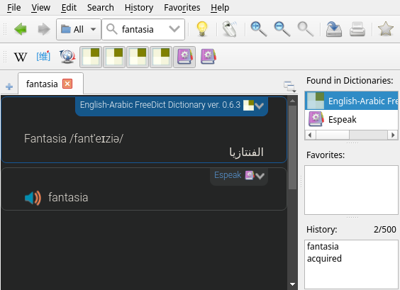

+++
title = "Setuping a human language dictionary (goldendict)"
date = 2026-09-04

[taxonomies]
categories = ["trying software"]

[extra]
toc = true
+++

there is no lightwieght offline translator for Linux?
fine, just use **goldendict**

<!-- more -->

## what is **goldendict**?
- **goldendict** is a desktop app that searchs in dictionaries for the word you typed, instead searching in a book manually, & it's very light & fast.
## "just use an online translator"
- 1st reason: not all people have access to internet all time.
- 2nd reason: [Russian spy get caught due to using Google Translation](https://www.msn.com/en-us/news/world/russian-spy-plot-exposed-after-google-translate-mistake/ar-AA1YJRC3)
## "just use **argostranslategui**"
- naah, bro, I hate python dependencies, it's hell, you should install 1000 library for less than 100mb software.
## but this is just a dictionary, not a translation app
- it fits the needs of someone who wants to learn a language, because translation apps abstract a lot of things & gives you only the final result,
so, when you translate by a dictionary, you are more likely to acquire vocabularies, & to understand how the sentence formed.

***
## setuping **goldendict**
### installing it
if you have debian, if you have something else, use your package manager instead.
```sh
sudo apt install goldendict -y
```
### downloading dictionaries
```sh
mkdir -p ~/.local/share/stardict/dic
cd ~/.local/share/stardict/dic

## you can visit https://download.freedict.org to select the dicts u want
wget https://download.freedict.org/dictionaries/eng-ara/0.6.3/freedict-eng-ara-0.6.3.dictd.tar.xz
wget https://download.freedict.org/dictionaries/ara-eng/0.6.3/freedict-ara-eng-0.6.3.dictd.tar.xz
wget https://download.freedict.org/dictionaries/fra-eng/0.4.1/freedict-fra-eng-0.4.1.dictd.tar.xz
wget https://download.freedict.org/dictionaries/eng-fra/0.1.6/freedict-eng-fra-0.1.6.dictd.tar.xz

tar xf ...
```
### giving **goldendict** the path where the dicts are
1. type in the terminal `goldendict`
1. *Edit* -> *Dictionaries* **OR** just click *F3*
1. click *Add...* & paste `~/.local/share/stardict/dic` in Directory & click *Choose* & then select *recursive*
1. click *Rescan now* & click *Apply* & then click *OK*
<br>

<span style="color: #ff0000">c</span> <span style="color: #ff7f00">o</span> <span style="color: #ffff00">n</span> <span style="color: #00ff00">g</span> <span style="color: #0000ff">r</span> <span style="color: #4b0082">a</span> <span style="color: #9400d3">t</span> <span style="color: #ff0000">u</span> <span style="color: #ff7f00">l</span> <span style="color: #ffff00">a</span> <span style="color: #00ff00">t</span> <span style="color: #0000ff">i</span> <span style="color: #4b0082">o</span> <span style="color: #9400d3">n</span> <span style="color: #ff0000">s</span>


<br>

