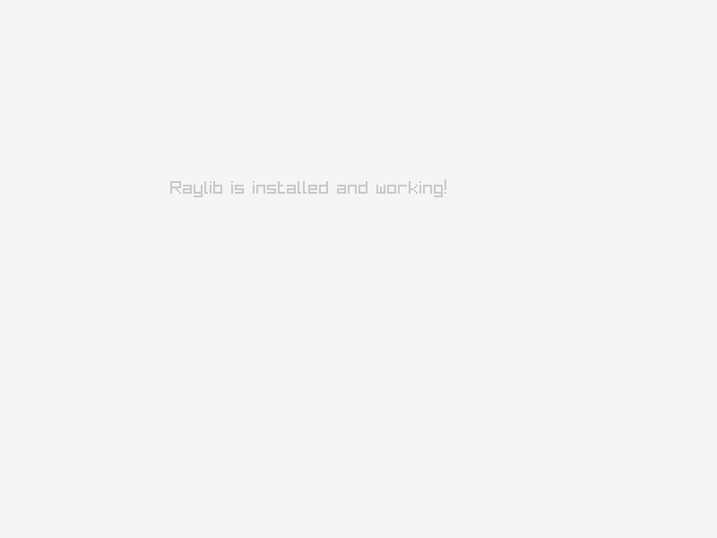

+++
title = "My first try with Raylib"
date = 2026-08-13

[taxonomies]
categories = ["programming", "game dev"]
tags = ["C"]

[extra]
toc = true
+++

what is Raylib?
how to setup it in a Linux machine?
how to compile it from source?
& how to use it to make games?

<!-- more -->

## what is Raylib?
- it is a game development library, that can be used with *C* or *C++*, or even a lot of other languages using a binding.
- it used to make 2D games & 3D games.
### why you should use Raylib for your apps/games?
- super easy syntax & logic
- easy to install & to compile & to deploy
- 2D & 3D
- you can make cross-platform desktop apps with it as well
- fast & small binary size
- can be used in old openGL env
## how to setup Raylib in a Linux machine?
- usually, you can install it just from your package manager,<br>but if you have an **old graphic card**, I can show you
### Installing Raylib by compiling the source on Debian
- that bash script is for printing the pc specs:
```sh
#!/bin/bash

echo "$(whoami)@$(hostname)"
echo ""
echo "OS: $(. /etc/os-release; echo $NAME) $(uname -m)"
echo "Host: $(cat /sys/class/dmi/id/product_name | sed 's/ *$//') ($(cat /sys/class/dmi/id/product_version))"
echo "Kernel: $(uname -s) $(uname -r)"
uptime -p | sed 's/up/Uptime:/'
echo "Shell: $(basename "$SHELL") $BASH_VERSION"
echo "CPU: $(grep -m1 'model name' /proc/cpuinfo | cut -d: -f2 | sed 's/^ //') ($(grep -c '^processor' /proc/cpuinfo)) @ $(awk
-F: '/cpu MHz/ {printf "%.2f", $2/1000; exit}' /proc/cpuinfo) GHz"
i=1
lspci | grep -E 'VGA|3D' | while read -r line; do
  gpu=$(echo "$line" | cut -d ':' -f3- | sed 's/^ //; s/ (rev.*//')
  echo "GPU $i: $gpu"
  i=$((i+1))
done
echo "Wifi adapter: $(lspci | grep -i 'network' | cut -d ':' -f3- | sed 's/^ //')"
echo "Locale: $LANG"
```
it prints, when I run it in my machine
```
unes@mx-linux

OS: Debian GNU/Linux x86_64
Host: EasyNote MH45 (LX.B190X.005)
Kernel: Linux 6.12.94+deb13-amd64
Uptime: 14 minutes
Shell: fish 5.2.37(1)-release
CPU: Pentium(R) Dual-Core CPU       T4200  @ 2.00GHz (2) @ 1.99 GHz
GPU 1: Intel Corporation Mobile 4 Series Chipset Integrated Graphics Controller
Wifi adapter: Ralink corp. RT2790 Wireless 802.11n 1T/2R PCIe
Locale: en_US.UTF-8
```
- [ ] `nano fet.sh`
- [ ] paste the code & save & exit
- [ ] `chmod +x fet.sh`
- [ ] `./fet.sh`

now you know what is the name of your hardware, & then you can search what is the *OpenGl version*, or how much *vram* you have

#### 1. Install Build Dependencies

Open your terminal and install the compiler toolchain, CMake, Git, and necessary X11/OpenGL development libraries via `apt`:

```sh
sudo apt update
sudo apt install build-essential git cmake \
  libasound2-dev libx11-dev libxrandr-dev libxi-dev \
  libgl1-mesa-dev libglu1-mesa-dev libxcursor-dev \
  libxinerama-dev libwayland-dev libxkbcommon-dev
```

maybe you feel uncomfortable because you write things you don't understand, I want to tell you that it's fine,
you don't have to understand everything that came before you, because it's abstracted on purpose, just focus on
one thing, "setuping the programming env", & then you can move to another thing, don't overwhelm yourself 💖

#### 2. Clone and Build Raylib

Clone the official Raylib repository, configure CMake to target **OpenGL 2.1**, compile using multiple cores, and install system-wide:

```bash
# Clone the repository (latest commit)
git clone --depth 1 https://github.com/raysan5/raylib.git
cd raylib

# Create and enter build directory
mkdir build && cd build

# Configure build with OpenGL 2.1 for legacy GPUs
cmake -DOPENGL_VERSION="2.1" -DBUILD_SHARED_LIBS=ON ..

# Compile using 2 CPU cores
make -j2

# Install system-wide to /usr/local
sudo make install

```

#### 3. Update Shared Library Cache

Register the newly installed `libraylib.so` with the dynamic linker:

```bash
sudo ldconfig

```

#### 4. Test Installation

Create a minimal test program to verify that the installation and display initialization work properly.

##### Create `test.c`:

```c
#include "raylib.h"

int main(void) {
    InitWindow(800, 600, "Raylib Installation Test");
    SetTargetFPS(60);

    while (!WindowShouldClose()) {
        BeginDrawing();
            ClearBackground(RAYWHITE);
            DrawText("Raylib is installed and working!", 190, 200, 20, LIGHTGRAY);
        EndDrawing();
    }

    CloseWindow();
    return 0;
}
```

##### Compile Command:

```sh
gcc test.c -lraylib -lGL -lm -lpthread -ldl -lrt -lX11 -o raylib_test
```

##### Run:

```sh
./raylib_test
```



#### Quick Reference / Troubleshooting

| Issue | Cause | Solution |
| --- | --- | --- |
| `error while loading shared libraries: libraylib.so` | Linker cache not updated | Run `sudo ldconfig` |
| `implicit declaration of function 'SetCameraMode'` | Raylib 5.0+ API change | Use `UpdateCamera(&camera, CAMERA_FIRST_PERSON)` directly |
| Raylib fails to initialize window | OpenGL driver mismatch | Ensure CMake was configured with `-DOPENGL_VERSION="2.1"` |

***
## Challenge:
### explaining the challenge:
I challenge you to make the same program as below, it have about 22 line, you can do it on less or more,
it does not matter, what matters is the result

- Size: 16.3 kB 
- RAM : 77 mb

<video style="width: 100%; height: auto;" controls>
  <source src="vid1.mp4" type="video/mp4">
</video>


### how you can solve it?

- Drawing the circle is done by `DrawCircle(x, y, size, LIGHTGRAY)`.
- Animation is done by variables and adding 1 to there values inside the while loop.
- The collision is done by `if (){}` & `GetScreenWidth()` & `GetScreenHeight()`.
